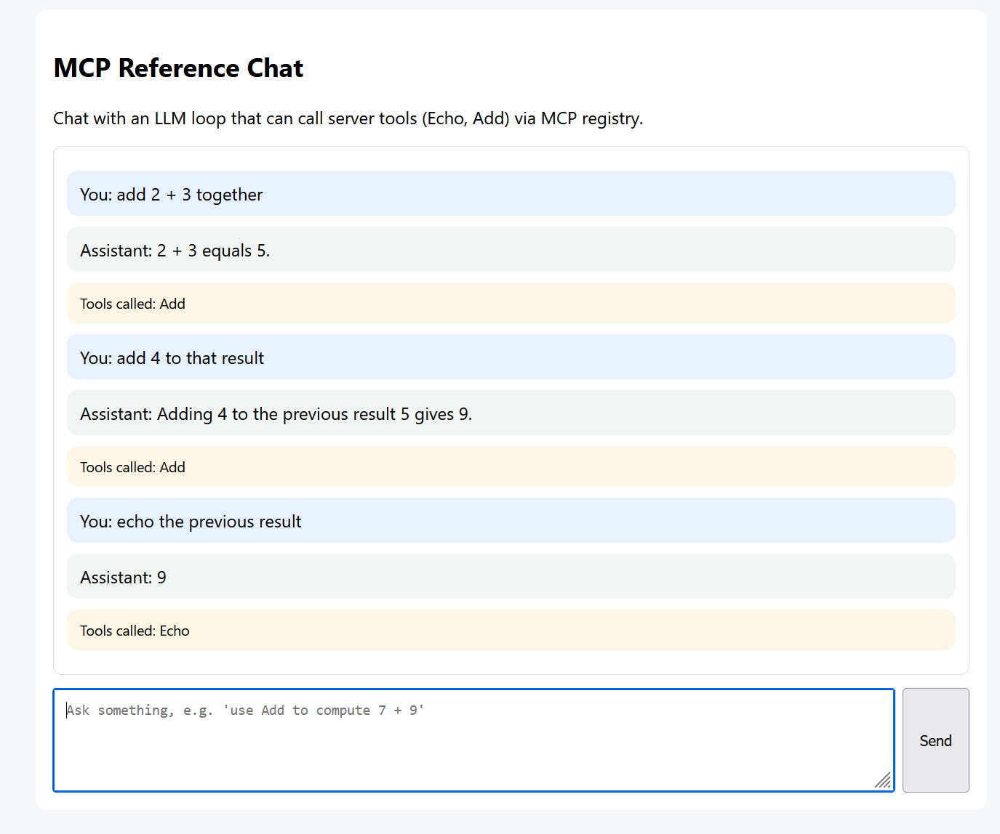

# MCP Reference (F#)

Reference MCP server implemented in F# on ASP.NET Core with:

- official `ModelContextProtocol.AspNetCore` middleware (`/mcp`)
- SignalR hub (`/hub`) for realtime interactions
- typed HTTP sample endpoints (`/mcp/echo`, `/mcp/add`)
- simple web chat UI (`/`) backed by an LLM tool-calling loop (`/api/chat`)



## Requirements

- .NET SDK 9.0+

## Quick start

```powershell
dotnet restore src/mcp_reference.fsproj
dotnet build src/mcp_reference.fsproj -c Debug
dotnet run --project src/mcp_reference.fsproj
```

Server listens on `http://127.0.0.1:5000`.

Set OpenAI environment variables for chat:

```powershell
$env:OPENAI_API_KEY = "<your-key>"
$env:OPENAI_MODEL = "gpt-4.1-mini"
# optional
$env:OPENAI_BASE_URL = "https://api.openai.com/v1/chat/completions"
```

## Endpoints

- `POST /mcp` — official MCP streamable HTTP endpoint (via `MapMcp("/mcp")`)
- `GET /` — health/home text
- `GET /mcp/tools` — local registry tool descriptors
- `POST /mcp/tools/{name}` — local registry invoke (JSON in, YAML/plain out)
- `POST /mcp/echo` — typed sample tool endpoint (`{ "Text": "hi" }`)
- `POST /mcp/add` — typed sample tool endpoint (`{ "A": 1, "B": 2 }`)
- `GET/POST /hub` — SignalR hub endpoint
- `POST /api/chat` — chat endpoint used by home page UI

## MCP tools exposed

The official MCP middleware discovers tools from `src/Core/McpTools.fs`:

- `Echo(text: string) -> string`
- `Add(a: int, b: int) -> int`
- `ListResources() -> string` — lists all available MCP resources
- `GetResource(uri: string) -> string` — retrieves content of a resource by URI

## MCP prompts exposed

The official MCP middleware discovers prompts from `src/Core/McpPrompts.fs`:

- `Greeting(name: string) -> GetPromptResult` — a friendly greeting prompt
- `CodeReview(code: string) -> GetPromptResult` — a code review prompt

## MCP resources exposed

The official MCP middleware discovers resources from `src/Core/McpResources.fs`:

- `info://server` (text/plain) — general server information
- `data://sample` (application/json) — a sample JSON data object

## Tests

```powershell
dotnet test tests/mcp_reference.Tests.fsproj -c Debug
```

Includes integration coverage for root HTTP, typed endpoints, SignalR, and MCP middleware mapping.

## MCPInspector quick connect

1. Run the server:

```powershell
dotnet run --project src/mcp_reference.fsproj
```

2. Point MCPInspector to:

- `http://127.0.0.1:5000/mcp`

3. Connect and call `tools/list`.

Expected: tool list includes `Echo` and `Add`.

## Notes on dependencies

- All package dependencies are managed by Paket
- Top-level packages and versions are declared in `paket.dependencies`
- Per-project package references are listed in `src/paket.references` and `tests/paket.references`
- The resolved dependency graph is locked in `paket.lock`
